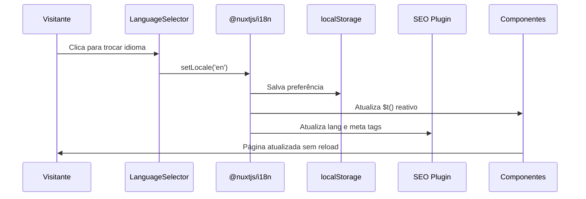

# Documento de Design — Versão em Inglês (i18n)

## Visão Geral

Este design descreve a implementação de internacionalização (i18n) no portfólio Nuxt 3, adicionando suporte ao idioma inglês (`en`) ao site atualmente em português (`pt-BR`). A solução utiliza o módulo `@nuxtjs/i18n` (baseado no `vue-i18n`), que é a abordagem padrão e recomendada para projetos Nuxt 3.

O site opera em modo SPA (`ssr: false`), o que simplifica a implementação — toda a troca de idioma acontece no client-side sem necessidade de rotas por locale ou server-side rendering por idioma.

### Decisões de Design

1. **Estratégia `no_prefix`**: Como o site é SPA estático (gerado via `nuxt generate`), não usaremos prefixos de rota (`/en/`, `/pt-BR/`). A troca de idioma é feita via estado client-side, mantendo a URL limpa.
2. **Lazy loading de traduções**: Arquivos de tradução carregados sob demanda para não impactar o bundle inicial.
3. **Dados traduzidos via arquivos de locale**: As traduções de conteúdo dinâmico (projetos, experiências) ficam nos próprios arquivos de tradução, referenciadas por chave, evitando duplicação de JSONs de dados.
4. **Composable centralizado**: Um composable `useLocaleData` encapsula a lógica de obter dados traduzidos dos JSONs, mantendo os componentes limpos.

## Arquitetura

```mermaid
graph TD
    A[nuxt.config.ts] -->|registra módulo| B[@nuxtjs/i18n]
    B -->|carrega| C[locales/pt-BR.json]
    B -->|carrega| D[locales/en.json]
    
    E[NavBar.vue] -->|contém| F[LanguageSelector]
    F -->|altera| B
    
    B -->|fornece $t| G[Componentes Vue]
    G -->|textos estáticos| C
    G -->|textos estáticos| D
    
    H[useLocaleData] -->|dados traduzidos| G
    H -->|lê locale ativo| B
    
    I[plugins/seo.js] -->|meta tags i18n| B
    
    J[localStorage] -->|persiste preferência| B
```

### Fluxo de Troca de Idioma



## Componentes e Interfaces

### 1. Módulo i18n (nuxt.config.ts)

Configuração do `@nuxtjs/i18n` no Nuxt:

```typescript
// nuxt.config.ts (trecho i18n)
modules: [
  '@nuxtjs/tailwindcss',
  '@nuxtjs/i18n'
],
i18n: {
  locales: [
    { code: 'pt-BR', file: 'pt-BR.json', name: 'Português' },
    { code: 'en', file: 'en.json', name: 'English' }
  ],
  defaultLocale: 'pt-BR',
  fallbackLocale: 'pt-BR',
  lazy: true,
  langDir: 'locales/',
  strategy: 'no_prefix',
  detectBrowserLanguage: {
    useCookie: false,
    fallbackLocale: 'pt-BR'
  }
}
```

### 2. Arquivos de Tradução

Estrutura dos arquivos em `locales/`:

```
locales/
├── pt-BR.json
└── en.json
```

Estrutura de chaves (exemplo parcial):

```json
{
  "nav": {
    "home": "Início",
    "about": "Sobre",
    "experience": "Experiência",
    "projects": "Projetos",
    "contact": "Contato"
  },
  "hero": {
    "viewProjects": "Ver Projetos",
    "contact": "Contato",
    "roles": ["Full Stack Developer", "Vue.js Enthusiast", "Problem Solver", "Open Source Contributor"]
  },
  "about": {
    "title": "Sobre Mim"
  },
  "experience": {
    "title": "Experiência",
    "subtitle": "{years}+ anos construindo soluções digitais",
    "present": "Presente",
    "expandMore": "Ver mais",
    "expandLess": "Ver menos",
    "months": ["Jan", "Fev", "Mar", "Abr", "Mai", "Jun", "Jul", "Ago", "Set", "Out", "Nov", "Dez"],
    "duration": {
      "year": "ano",
      "years": "anos",
      "month": "mês",
      "months": "meses",
      "and": "e"
    },
    "employmentType": {
      "Full-time": "Tempo integral",
      "Part-time": "Meio período",
      "Contract": "Contrato",
      "Internship": "Estágio",
      "Freelance": "Freelance"
    }
  },
  "projects": {
    "title": "Projetos",
    "featured": "Destaques",
    "openSource": "Open Source",
    "research": "Pesquisa"
  },
  "contact": {
    "title": "Vamos conversar?",
    "text": "Estou aberto a novas oportunidades...",
    "sendEmail": "Enviar e-mail"
  },
  "footer": {
    "easterEggHint": "Dica: Digite \"math\" para revelar easter eggs matemáticos e procure pelo cubo mágico!"
  },
  "data": {
    "summary": "👋Olá! Sou Gustavo Lacerda...",
    "positions": {
      "dataprev": {
        "title": "Analista de sistema",
        "description": "- Desenvolvimento solo da Plataforma..."
      }
    },
    "featuredProjects": {
      "calculadoras-medware": {
        "description": "Ferramenta de cálculos médicos..."
      }
    }
  }
}
```

### 3. Componente LanguageSelector

Novo componente para troca de idioma:

```vue
<!-- components/LanguageSelector.vue -->
<template>
  <button
    @click="toggleLocale"
    class="lang-selector"
    :aria-label="ariaLabel"
    type="button"
  >
    <span class="lang-code">{{ otherLocale.code === 'en' ? 'EN' : 'PT' }}</span>
  </button>
</template>
```

**Interface:**
- `toggleLocale()`: Alterna entre `pt-BR` e `en` usando `setLocale()` do `@nuxtjs/i18n`
- Exibe o código do idioma alternativo (clicável para trocar)
- Acessível via teclado (é um `<button>`)
- `aria-label` dinâmico descrevendo a ação

### 4. Composable useLocaleData

```typescript
// composables/useLocaleData.ts
export function useLocaleData() {
  const { t, locale } = useI18n()

  const getProjectDescription = (projectKey: string): string => {
    return t(`data.featuredProjects.${projectKey}.description`)
  }

  const getPositionTitle = (positionKey: string): string => {
    return t(`data.positions.${positionKey}.title`)
  }

  const getPositionDescription = (positionKey: string): string => {
    return t(`data.positions.${positionKey}.description`)
  }

  const getSummary = (): string => {
    return t('data.summary')
  }

  return { getProjectDescription, getPositionTitle, getPositionDescription, getSummary, locale }
}
```

### 5. Plugin SEO Atualizado

O `plugins/seo.js` será atualizado para usar `useI18n()` e reagir a mudanças de locale:

```javascript
// Atualiza dinamicamente:
// - document.documentElement.lang
// - og:title, og:description
// - twitter:title, twitter:description
// - <link rel="alternate" hreflang="...">
```

## Modelos de Dados

### Estrutura do Arquivo de Tradução

```typescript
interface TranslationFile {
  nav: {
    home: string
    about: string
    experience: string
    projects: string
    contact: string
  }
  hero: {
    viewProjects: string
    contact: string
    roles: string[]
  }
  about: {
    title: string
  }
  experience: {
    title: string
    subtitle: string  // template com {years}
    present: string
    expandMore: string
    expandLess: string
    months: string[]  // 12 abreviações
    duration: {
      year: string
      years: string
      month: string
      months: string
      and: string
    }
    employmentType: Record<string, string>
  }
  projects: {
    title: string
    featured: string
    openSource: string
    research: string
  }
  contact: {
    title: string
    text: string
    sendEmail: string
  }
  footer: {
    easterEggHint: string
  }
  seo: {
    title: string
    description: string
  }
  data: {
    summary: string
    positions: Record<string, {
      title: string
      description: string
    }>
    featuredProjects: Record<string, {
      description: string
    }>
  }
}
```

### Mapeamento de Chaves de Posição

As posições do `linkedin_profile.json` serão mapeadas por chave derivada do `companyName` em kebab-case:

| companyName | Chave de tradução |
|---|---|
| DATAPREV | `data.positions.dataprev` |
| Medware Sistemas Médicos | `data.positions.medware` |
| Xpbox Digital | `data.positions.xpbox` |
| Tribunal de Contas da União | `data.positions.tcu` |
| IFB - Instituto Federal de Brasília | `data.positions.ifb` |

### Mapeamento de Chaves de Projetos

| Projeto | Chave de tradução |
|---|---|
| Calculadoras Medware | `data.featuredProjects.calculadoras-medware` |
| MoneySuite | `data.featuredProjects.moneysuite` |
| SIMP — TCU | `data.featuredProjects.simp-tcu` |
| Deep Fake Detection | `data.featuredProjects.deep-fake-detection` |


## Propriedades de Corretude

*Uma propriedade é uma característica ou comportamento que deve ser verdadeiro em todas as execuções válidas de um sistema — essencialmente, uma declaração formal sobre o que o sistema deve fazer. Propriedades servem como ponte entre especificações legíveis por humanos e garantias de corretude verificáveis por máquina.*

### Propriedade 1: Completude das chaves de tradução

*Para qualquer* chave presente no arquivo de tradução `pt-BR.json`, essa mesma chave deve existir no arquivo `en.json`, garantindo que nenhuma tradução esteja faltando.

**Valida: Requisitos 2.1, 2.3**

### Propriedade 2: Fallback para pt-BR em chaves ausentes

*Para qualquer* chave de tradução que não exista no locale ativo, o sistema deve retornar o valor correspondente do locale `pt-BR` (fallback), nunca retornando uma chave bruta ou string vazia.

**Valida: Requisito 2.4**

### Propriedade 3: Conteúdo de dados por locale

*Para qualquer* chave de dados traduzível (posições profissionais, projetos em destaque, resumo) e *para qualquer* locale (`pt-BR` ou `en`), o sistema de tradução deve retornar o valor correspondente ao locale ativo a partir do arquivo de tradução correto.

**Valida: Requisitos 3.1, 3.3, 3.4, 3.5**

### Propriedade 4: Toggle de locale é round-trip

*Para qualquer* locale ativo, clicar no seletor de idioma duas vezes consecutivas deve retornar ao locale original, preservando o estado.

**Valida: Requisito 4.2**

### Propriedade 5: Persistência de locale é round-trip

*Para qualquer* locale válido (`pt-BR` ou `en`), armazenar a preferência no localStorage e depois recuperá-la deve retornar exatamente o mesmo locale que foi armazenado.

**Valida: Requisitos 5.1, 5.2**

### Propriedade 6: Atributo lang do HTML corresponde ao locale ativo

*Para qualquer* locale ativo, o atributo `lang` do elemento `<html>` deve ser igual ao código do locale ativo.

**Valida: Requisitos 6.1, 6.2**

### Propriedade 7: Meta tags SEO correspondem ao locale ativo

*Para qualquer* locale ativo, as meta tags `og:title` e `og:description` devem conter os valores traduzidos correspondentes ao locale ativo.

**Valida: Requisito 6.3**

### Propriedade 8: Formatação do ExperienceItem por locale

*Para qualquer* índice de mês (0-11), *para qualquer* duração válida (anos e meses), e *para qualquer* tipo de emprego, as funções de formatação do ExperienceItem devem retornar strings no idioma correspondente ao locale ativo (meses em inglês/português, durações com palavras no idioma correto, tipos de emprego traduzidos).

**Valida: Requisitos 7.1, 7.2, 7.3**

### Propriedade 9: Roles do efeito de digitação por locale

*Para qualquer* locale ativo, o array de roles exibido no efeito de digitação do HeroSection deve corresponder ao array definido no arquivo de tradução do locale ativo.

**Valida: Requisito 7.5**

## Tratamento de Erros

| Cenário | Tratamento |
|---|---|
| Arquivo de tradução não carrega | Fallback para `pt-BR` (locale padrão) |
| Chave de tradução inexistente no locale ativo | Exibe valor do `pt-BR` via fallback do `vue-i18n` |
| localStorage indisponível (modo privado) | Usa `pt-BR` como padrão, sem persistência |
| Chave de dados inexistente (projeto/posição) | Retorna string vazia; componente exibe texto original do JSON |
| Erro ao trocar locale | Mantém locale atual, loga erro no console |

## Estratégia de Testes

### Abordagem Dual

A estratégia combina testes unitários e testes baseados em propriedades (property-based testing) para cobertura abrangente:

- **Testes unitários**: Verificam exemplos específicos, edge cases e condições de erro
- **Testes de propriedade**: Verificam propriedades universais em todas as entradas válidas

### Biblioteca de Property-Based Testing

Utilizar **fast-check** (`fc`) como biblioteca de PBT para JavaScript/TypeScript, por ser a mais madura e bem integrada com o ecossistema Vue/Nuxt.

### Configuração dos Testes de Propriedade

- Mínimo de 100 iterações por teste de propriedade
- Cada teste deve referenciar a propriedade do design com um comentário no formato:
  **Feature: english-version, Property {número}: {título}**
- Cada propriedade de corretude deve ser implementada por um ÚNICO teste de propriedade

### Testes Unitários

Focar em:
- Verificação de que o `LanguageSelector` renderiza corretamente na NavBar (Requisito 4.1)
- Verificação de que o seletor indica o idioma ativo (Requisito 4.4)
- Acessibilidade do seletor: `aria-label` e navegação por teclado (Requisito 4.5)
- Presença das tags `<link rel="alternate" hreflang>` (Requisito 6.4)
- Conteúdo do `pt-BR.json` corresponde aos textos atuais em português (Requisito 2.2)
- Locale padrão quando localStorage está vazio (Requisito 5.3, edge case)
- Texto "Present"/"Presente" para posições atuais (Requisito 7.4, edge case)
- Label "Research"/"Pesquisa" para projetos de pesquisa (Requisito 7.6, edge case)

### Testes de Propriedade

Implementar um teste para cada propriedade de corretude (Propriedades 1-9), usando `fast-check` com geradores para:
- Chaves de tradução aleatórias extraídas dos arquivos de locale
- Índices de mês (0-11)
- Durações aleatórias (combinações de anos 0-10 e meses 0-11)
- Tipos de emprego aleatórios do conjunto definido
- Locales aleatórios do conjunto `['pt-BR', 'en']`

### Framework de Testes

Utilizar **Vitest** como test runner, compatível nativamente com Nuxt 3 e com suporte a `fast-check`.
