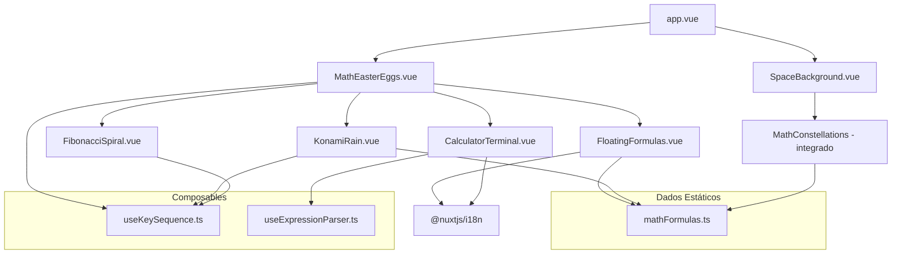

# Documento de Design — Math Easter Eggs

## Visão Geral

Este design descreve a evolução do componente `MathEasterEgg.vue` para um sistema de 5 experiências interativas matemáticas no portfólio Nuxt.js. O componente monolítico atual será substituído por um orquestrador (`MathEasterEggs.vue`) que coordena 5 sub-componentes independentes, cada um responsável por uma experiência:

1. **Chuva de Fórmulas (Matrix)** — overlay Canvas 2D ativado pelo Konami Code
2. **Fórmulas Flutuantes** — partículas CSS com tooltip i18n ao clicar
3. **Constelações Matemáticas** — integração Three.js no SpaceBackground existente
4. **Calculadora Terminal** — parser de expressões seguro (sem eval), ativado por Ctrl+Shift+M
5. **Espiral de Fibonacci** — animação Canvas 2D ativada pela sequência "fibonacci"

O sistema é client-only (SPA, `ssr: false`) e utiliza composables Vue 3 para lógica reutilizável (detecção de sequências de teclas, avaliação de expressões).

## Arquitetura

### Diagrama de Componentes



### Decisões Arquiteturais

1. **Orquestrador em vez de monolito**: O `MathEasterEggs.vue` substitui `MathEasterEgg.vue` no `app.vue`. Cada feature é um componente isolado, facilitando manutenção e lazy loading.

2. **Composable `useKeySequence`**: Reutilizado pelo Konami Code e pela sequência "fibonacci". Aceita uma sequência-alvo e um timeout de reset, retorna um ref reativo que indica quando a sequência foi completada.

3. **Composable `useExpressionParser`**: Parser matemático seguro usando Shunting-Yard algorithm. Sem dependências externas, sem `eval()`, sem `Function()`. Suporta `+`, `-`, `*`, `/`, `^`, `(`, `)`, `pi`, `e`.

4. **Constelações integradas no SpaceBackground**: Em vez de criar um componente separado, as constelações são adicionadas diretamente à cena Three.js existente via uma função `addMathConstellations(scene, camera, renderer)` exportada de um módulo utilitário. Isso evita múltiplos renderers WebGL e conflitos de contexto.

5. **Dados centralizados em `mathFormulas.ts`**: Todas as fórmulas, explicações (chaves i18n) e metadados ficam num único arquivo, consumido por todos os componentes que precisam de fórmulas.

6. **Canvas 2D para animações overlay**: Tanto a Chuva de Fórmulas quanto a Espiral de Fibonacci usam Canvas 2D nativo (não Three.js), pois são overlays temporários que não precisam de cena 3D persistente.

## Componentes e Interfaces

### 1. MathEasterEggs.vue (Orquestrador)

Substitui `MathEasterEgg.vue` no `app.vue`. Monta os sub-componentes e gerencia estado global dos easter eggs.

```typescript
// Props: nenhuma
// Emits: nenhum
// Responsabilidades:
// - Montar KonamiRain, FloatingFormulas, CalculatorTerminal, FibonacciSpiral
// - Usar useKeySequence para detectar Konami Code e "fibonacci"
// - Passar estado de ativação para sub-componentes via v-if/v-show
```

### 2. KonamiRain.vue

Overlay fullscreen com Canvas 2D que renderiza fórmulas caindo estilo Matrix.

```typescript
interface KonamiRainProps {
  active: boolean  // controlado pelo orquestrador
}

interface KonamiRainEmits {
  (e: 'close'): void  // quando animação termina ou Escape
}

// Comportamento:
// - Ao ativar: cria canvas fullscreen, inicia colunas de fórmulas caindo
// - Cor verde #00ff41, fundo rgba(0,0,0,0.9)
// - Mínimo 8 fórmulas distintas nas colunas
// - Auto-encerra após 8s ou Escape, com fade-out de 1s
// - pointer-events: all no overlay (bloqueia interação)
```

### 3. FloatingFormulas.vue

Fórmulas flutuantes no fundo da página com tooltip ao clicar.

```typescript
interface FloatingFormula {
  id: string
  formula: string
  explanationKey: string  // chave i18n
  x: number
  y: number
  vx: number  // velocidade senoidal
  vy: number
  opacity: number  // 0.15 a 0.3
  phase: number    // fase da interpolação senoidal
}

interface FloatingFormulasEmits {
  // nenhum — componente auto-contido
}

// Comportamento:
// - Renderiza ≥6 fórmulas com position: fixed
// - Movimento senoidal contínuo (0.2-0.5 px/frame)
// - Hover: opacidade → 0.8 (transição 300ms CSS)
// - Click: tooltip com explicação i18n, animação scale 0→1 em 400ms
// - Click fora / Escape: fecha tooltip com fade-out 300ms
// - Detecção de sobreposição: reposiciona se bounding boxes colidem
```

### 4. MathConstellations (módulo utilitário)

Função que adiciona constelações à cena Three.js existente do SpaceBackground.

```typescript
// utils/mathConstellations.ts
interface ConstellationStar {
  position: THREE.Vector3
  formula: string
  labelSprite: THREE.Sprite | null
}

interface Constellation {
  stars: ConstellationStar[]
  lines: THREE.Line
}

export function addMathConstellations(
  scene: THREE.Scene,
  camera: THREE.Camera,
  renderer: THREE.WebGLRenderer
): {
  constellations: Constellation[]
  update: (mouseX: number, mouseY: number) => void  // chamado no loop de animação
  dispose: () => void
  updateTheme: (isLight: boolean) => void
}

// Comportamento:
// - Cria ≥5 estrelas-fórmula como Points com glow
// - Conecta com Lines semi-transparentes (opacidade 0.15) em ≥2 constelações
// - Hover (raio 80px via raycaster): glow pulsante na estrela + linhas
// - Hover direto: label flutuante com texto da fórmula
// - Posicionamento: evita região do sistema solar (x>50, y<0, z<-100)
// - Tema claro: cores escuras em vez de luminosas
```

### 5. CalculatorTerminal.vue

Terminal minimalista com parser de expressões seguro.

```typescript
interface CalculatorTerminalProps {
  active: boolean
}

interface CalculatorTerminalEmits {
  (e: 'close'): void
}

interface HistoryEntry {
  expression: string
  result: string
  isError: boolean
}

// Comportamento:
// - Ativado por Ctrl+Shift+M (Cmd+Shift+M no macOS)
// - Slide-in de baixo em 400ms, slide-out em 300ms
// - Estilo terminal: fonte mono, fundo escuro, texto verde, prompt ">"
// - Enter: avalia expressão via useExpressionParser
// - Resultado com animação de digitação caractere por caractere
// - Expressão inválida: "Expressão inválida" em vermelho
// - Histórico: últimas 10 expressões, navegável com ↑↓
// - "help": lista operadores e constantes
// - Escape / click fora: fecha
// - Foco automático ao abrir, retorno de foco ao fechar
```

### 6. FibonacciSpiral.vue

Overlay com Canvas 2D que desenha a espiral áurea animada.

```typescript
interface FibonacciSpiralProps {
  active: boolean
}

interface FibonacciSpiralEmits {
  (e: 'close'): void
}

// Comportamento:
// - Ativado pela sequência "fibonacci" no teclado
// - Overlay centralizado com Canvas 2D
// - Desenha espiral progressivamente em 4s com easing
// - Quadrados de Fibonacci com bordas semi-transparentes
// - Números (1,1,2,3,5,8,13,21,34,55) nos vértices
// - Razão áurea (φ ≈ 1.618) com contagem incremental no canto
// - Escape ou fim da animação: fade-out 1s
// - Responsivo: adapta ao viewport (320px a 2560px)
```

### 7. useKeySequence.ts (Composable)

```typescript
// composables/useKeySequence.ts
export function useKeySequence(
  targetSequence: string[],  // ex: ['ArrowUp','ArrowUp','ArrowDown',...]
  options?: {
    timeout?: number       // ms para reset (default: 3000)
    ignoreOtherKeys?: boolean  // true = ignora teclas fora da sequência
  }
): {
  triggered: Ref<boolean>
  reset: () => void
}
```

### 8. useExpressionParser.ts (Composable)

```typescript
// composables/useExpressionParser.ts
export interface ParseResult {
  success: boolean
  value: number
  error?: string
}

export function useExpressionParser(): {
  evaluate: (expression: string) => ParseResult
}

// Implementação: Shunting-Yard algorithm
// Tokens suportados: números, +, -, *, /, ^, (, ), pi, e
// Sem eval(), sem Function(), sem new Function()
// Retorna ParseResult com success/value/error
```

## Modelos de Dados

### mathFormulas.ts

```typescript
// utils/mathFormulas.ts
export interface MathFormula {
  id: string
  text: string              // representação visual (Unicode/LaTeX-like)
  explanationKey: string    // chave i18n para explicação
  category: 'calculus' | 'algebra' | 'geometry' | 'physics' | 'probability' | 'sequence'
}

export const MATH_FORMULAS: MathFormula[] = [
  { id: 'euler', text: 'e^{iπ} + 1 = 0', explanationKey: 'mathEggs.euler', category: 'algebra' },
  { id: 'gaussian', text: '∫₀^∞ e^{-x²}dx = √π/2', explanationKey: 'mathEggs.gaussian', category: 'calculus' },
  { id: 'fibonacci', text: 'Fₙ = Fₙ₋₁ + Fₙ₋₂', explanationKey: 'mathEggs.fibonacci', category: 'sequence' },
  { id: 'basel', text: 'Σ 1/n² = π²/6', explanationKey: 'mathEggs.basel', category: 'calculus' },
  { id: 'euler-limit', text: 'lim(1+1/n)ⁿ = e', explanationKey: 'mathEggs.eulerLimit', category: 'calculus' },
  { id: 'pythagoras', text: 'a² + b² = c²', explanationKey: 'mathEggs.pythagoras', category: 'geometry' },
  { id: 'maxwell', text: '∇×E = -∂B/∂t', explanationKey: 'mathEggs.maxwell', category: 'physics' },
  { id: 'bayes', text: 'P(A|B) = P(B|A)P(A)/P(B)', explanationKey: 'mathEggs.bayes', category: 'probability' },
  { id: 'golden-ratio', text: 'φ = (1+√5)/2', explanationKey: 'mathEggs.goldenRatio', category: 'algebra' },
  { id: 'quadratic', text: 'x = (-b±√(b²-4ac))/2a', explanationKey: 'mathEggs.quadratic', category: 'algebra' },
]

// Sequência Konami Code
export const KONAMI_SEQUENCE = [
  'ArrowUp', 'ArrowUp', 'ArrowDown', 'ArrowDown',
  'ArrowLeft', 'ArrowRight', 'ArrowLeft', 'ArrowRight',
  'b', 'a'
]

// Sequência Fibonacci
export const FIBONACCI_SEQUENCE = ['f','i','b','o','n','a','c','c','i']

// Números de Fibonacci para a espiral
export const FIBONACCI_NUMBERS = [1, 1, 2, 3, 5, 8, 13, 21, 34, 55]
```

### Chaves i18n (adições aos locales)

```json
// Adições ao locales/pt-BR.json e locales/en.json
{
  "mathEggs": {
    "euler": "A identidade de Euler conecta os 5 números mais importantes da matemática numa única equação elegante.",
    "gaussian": "A integral gaussiana é fundamental em probabilidade e estatística, base da distribuição normal.",
    "fibonacci": "Cada número de Fibonacci é a soma dos dois anteriores. A sequência aparece em espirais da natureza.",
    "basel": "O problema de Basel, resolvido por Euler em 1734, mostra que a soma dos inversos dos quadrados converge para π²/6.",
    "eulerLimit": "Este limite define o número de Euler (e ≈ 2.718), base dos logaritmos naturais e do crescimento exponencial.",
    "pythagoras": "O teorema de Pitágoras relaciona os lados de um triângulo retângulo. Conhecido há mais de 2500 anos.",
    "maxwell": "A lei de Faraday-Maxwell descreve como campos elétricos variáveis geram campos magnéticos.",
    "bayes": "O teorema de Bayes permite atualizar probabilidades com base em novas evidências. Fundamental em IA e estatística.",
    "goldenRatio": "A razão áurea (φ ≈ 1.618) aparece na arte, arquitetura e natureza. É o limite da razão entre Fibonacci consecutivos.",
    "quadratic": "A fórmula de Bhaskara resolve qualquer equação do segundo grau. Conhecida por todo estudante de matemática.",
    "calculator": {
      "help": "Operadores: + - * / ^ ( )\nConstantes: pi, e\nExemplos: 2^10, pi*3, (1+5)/2",
      "invalidExpression": "Expressão inválida",
      "placeholder": "Digite uma expressão..."
    }
  }
}
```

### Estrutura do Expression Parser

```typescript
// Tokens do parser
type TokenType = 'number' | 'operator' | 'lparen' | 'rparen' | 'constant'

interface Token {
  type: TokenType
  value: string
  numericValue?: number
}

// Operadores com precedência
interface OperatorInfo {
  precedence: number
  associativity: 'left' | 'right'
  fn: (a: number, b: number) => number
}

const OPERATORS: Record<string, OperatorInfo> = {
  '+': { precedence: 1, associativity: 'left', fn: (a, b) => a + b },
  '-': { precedence: 1, associativity: 'left', fn: (a, b) => a - b },
  '*': { precedence: 2, associativity: 'left', fn: (a, b) => a * b },
  '/': { precedence: 2, associativity: 'left', fn: (a, b) => a / b },
  '^': { precedence: 3, associativity: 'right', fn: (a, b) => Math.pow(a, b) },
}

const CONSTANTS: Record<string, number> = {
  'pi': Math.PI,
  'e': Math.E,
}
```
