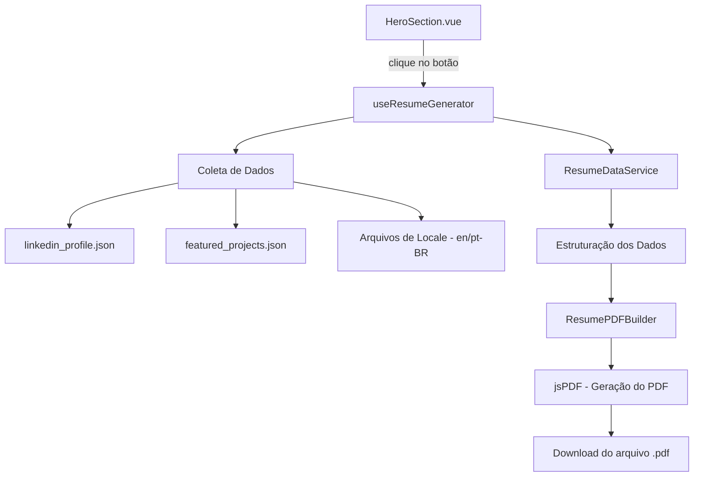

# Documento de Design: Resume Download

## Visão Geral

Esta feature implementa um gerador de currículo em PDF no lado do cliente, acionado por um botão na seção Hero do portfólio. O PDF é montado a partir dos dados já existentes no site (`linkedin_profile.json`, `featured_projects.json`, arquivos de locale) e segue as melhores práticas de compatibilidade com ATS (Applicant Tracking System) e design moderno de currículos.

A biblioteca `jspdf` será utilizada para gerar o PDF diretamente no navegador, sem dependência de servidor. O composable `useResumeGenerator` centralizará toda a lógica de coleta de dados, formatação e geração do documento.

### Decisões de Design

- **jsPDF** como biblioteca de geração de PDF: é leve (~280KB), funciona 100% client-side, suporta fontes padrão (Helvetica), e é a mais madura para geração de PDF no browser. Alternativas como `pdf-lib` foram descartadas por não terem suporte nativo a text wrapping e layout.
- **Composable dedicado** (`useResumeGenerator`): isola a lógica de geração do PDF do componente Vue, facilitando testes e reutilização.
- **Sem dependência de servidor**: toda a geração acontece no browser, mantendo o portfólio como site estático.

## Arquitetura



### Fluxo Principal

1. Usuário clica no botão "Download CV" / "Baixar Currículo"
2. O composable `useResumeGenerator` é invocado
3. `ResumeDataService` coleta e estrutura os dados do perfil a partir das fontes de dados
4. `ResumePDFBuilder` recebe os dados estruturados e monta o PDF usando jsPDF
5. O PDF é salvo automaticamente como `Gustavo_Cunha_Lacerda_CV.pdf`

## Componentes e Interfaces

### 1. Botão de Download (HeroSection.vue)

O botão será adicionado ao `div.hero-buttons` existente no `HeroSection.vue`, ao lado dos botões "Ver Projetos" e "Contato".

```vue
<button
  class="btn btn-accent"
  :disabled="isGenerating"
  @click="handleDownloadCV"
  :aria-label="$t('hero.downloadCV')"
>
  <svg v-if="!isGenerating" class="icon-download" .../>
  <svg v-else class="icon-spinner animate-spin" .../>
  {{ isGenerating ? $t('hero.generating') : $t('hero.downloadCV') }}
</button>
```

### 2. Composable: useResumeGenerator

```typescript
// composables/useResumeGenerator.ts
interface UseResumeGeneratorReturn {
  isGenerating: Ref<boolean>
  error: Ref<string | null>
  generateResume: () => Promise<void>
}

export function useResumeGenerator(): UseResumeGeneratorReturn
```

Responsabilidades:
- Gerenciar estado de carregamento (`isGenerating`)
- Gerenciar estado de erro (`error`)
- Orquestrar a coleta de dados e geração do PDF
- Disparar o download do arquivo

### 3. Serviço: ResumeDataService

```typescript
// utils/resume/ResumeDataService.ts
interface ResumeData {
  name: string
  headline: string
  summary: string
  contact: ContactInfo
  experience: ExperienceEntry[]
  skills: string[]
  education: EducationEntry[]
  certifications: CertificationEntry[]
  projects: ProjectEntry[]
}

interface ContactInfo {
  location: string
  email: string
  linkedin: string
  github: string
}

interface ExperienceEntry {
  title: string
  company: string
  location: string
  startDate: string
  endDate: string
  employmentType: string
  description: string[]
}

interface EducationEntry {
  institution: string
  degree: string
  fieldOfStudy: string
  startYear: number
  endYear: number
  grade?: string
}

interface CertificationEntry {
  name: string
  authority: string
  date: string
}

interface ProjectEntry {
  name: string
  description: string
  techs: string[]
}

function collectResumeData(
  locale: string,
  t: (key: string) => string
): ResumeData
```

Responsabilidades:
- Ler dados de `linkedin_profile.json` e `featured_projects.json`
- Usar a função `t()` do i18n para obter textos traduzidos
- Formatar datas de acordo com o locale ativo
- Retornar um objeto `ResumeData` estruturado

### 4. Builder: ResumePDFBuilder

```typescript
// utils/resume/ResumePDFBuilder.ts
interface PDFConfig {
  pageWidth: number      // 210mm (A4)
  pageHeight: number     // 297mm (A4)
  marginTop: number      // 20mm
  marginBottom: number   // 20mm
  marginLeft: number     // 20mm
  marginRight: number    // 20mm
  accentColor: string    // cor de destaque para títulos
  fontSizes: {
    name: number         // 20pt
    sectionTitle: number // 13pt
    body: number         // 10pt
    small: number        // 9pt
  }
}

function buildResumePDF(data: ResumeData, config: PDFConfig): jsPDF
```

Responsabilidades:
- Criar o documento jsPDF com configuração A4
- Renderizar cada seção na ordem correta (Cabeçalho, Resumo, Experiência, Habilidades, Educação, Certificações, Projetos)
- Gerenciar paginação (quebra de página quando necessário, limite de 2 páginas)
- Aplicar formatação ATS-compatível (fonte Helvetica, hierarquia de títulos, linhas separadoras)
- Alinhar datas à direita
- Usar bullet points (•) para realizações


## Modelos de Dados

### ResumeData (estrutura central)

```typescript
interface ResumeData {
  name: string                      // "Gustavo Cunha Lacerda"
  headline: string                  // título profissional
  summary: string                   // resumo profissional traduzido
  contact: ContactInfo              // informações de contato
  experience: ExperienceEntry[]     // experiências profissionais ordenadas por data
  skills: string[]                  // habilidades técnicas como strings
  education: EducationEntry[]       // formação acadêmica
  certifications: CertificationEntry[] // certificações e cursos
  projects: ProjectEntry[]          // projetos em destaque
}
```

### Mapeamento de Fontes de Dados

| Campo ResumeData | Fonte | Transformação |
|---|---|---|
| `name` | `linkedin_profile.json` → `firstName` + `lastName` | Concatenação |
| `summary` | `locales/{locale}.json` → `data.summary` | Tradução via i18n |
| `contact.location` | `linkedin_profile.json` → `geo.full` | Direto |
| `contact.linkedin` | `linkedin_profile.json` → `username` | Construir URL |
| `contact.github` | Hardcoded ou locale | URL do GitHub |
| `experience[]` | `linkedin_profile.json` → `position[]` + `locales/{locale}.json` → `data.positions.*` | Merge: dados estruturais do LinkedIn + textos traduzidos do locale |
| `skills[]` | `linkedin_profile.json` → `skills[].name` | Extração de nomes |
| `education[]` | `linkedin_profile.json` → `educations[]` | Formatação de datas |
| `certifications[]` | `linkedin_profile.json` → `certifications[]` | Formatação de datas |
| `projects[]` | `featured_projects.json` + `locales/{locale}.json` → `data.featuredProjects.*` | Merge: dados estruturais + descrições traduzidas |

### Formatação de Datas

```typescript
function formatDate(year: number, month: number, locale: string): string {
  // locale "en": "Jun 2024"
  // locale "pt-BR": "Jun 2024"
  // Se year === 0: retorna "Present" / "Presente"
}
```

Os meses são obtidos de `experience.months` nos arquivos de locale (`["Jan", "Feb", ...]` / `["Jan", "Fev", ...]`).

### Chaves i18n Necessárias (novas)

```json
{
  "hero": {
    "downloadCV": "Download CV | Baixar Currículo",
    "generating": "Generating... | Gerando..."
  },
  "resume": {
    "sections": {
      "summary": "Professional Summary | Resumo Profissional",
      "experience": "Professional Experience | Experiência Profissional",
      "skills": "Technical Skills | Habilidades Técnicas",
      "education": "Education | Educação",
      "certifications": "Certifications | Certificações",
      "projects": "Featured Projects | Projetos em Destaque"
    },
    "present": "Present | Presente",
    "error": "Error generating CV. Please try again. | Erro ao gerar currículo. Tente novamente."
  }
}
```


## Propriedades de Corretude

*Uma propriedade é uma característica ou comportamento que deve ser verdadeiro em todas as execuções válidas de um sistema — essencialmente, uma declaração formal sobre o que o sistema deve fazer. Propriedades servem como ponte entre especificações legíveis por humanos e garantias de corretude verificáveis por máquina.*

### Propriedade 1: Completude da coleta de dados

*Para qualquer* conjunto válido de dados de perfil (linkedin_profile.json + featured_projects.json), a função `collectResumeData` deve produzir um `ResumeData` que contenha todas as entradas de experiência, habilidades, educação, certificações, projetos, resumo e informações de contato presentes nos dados de origem.

**Valida: Requisitos 2.1, 2.2, 2.3, 2.4, 2.5, 2.6, 2.8**

### Propriedade 2: Consistência de textos por locale

*Para qualquer* locale suportado ("en" ou "pt-BR"), todos os textos coletados por `collectResumeData` (rótulos de seção, descrições de experiência, descrições de projetos, resumo profissional) devem corresponder aos valores definidos no arquivo de locale correspondente.

**Valida: Requisitos 2.7, 5.1, 5.2, 5.3, 5.4**

### Propriedade 3: Formatação de datas com locale e tratamento de "Presente"

*Para qualquer* data válida (ano > 0, mês entre 1-12) e qualquer locale, a função `formatDate` deve retornar uma string contendo o nome abreviado do mês no locale correto seguido do ano. *Para qualquer* data com ano === 0, a função deve retornar "Present" (en) ou "Presente" (pt-BR) de acordo com o locale ativo.

**Valida: Requisitos 5.5, 6.4**

### Propriedade 4: Ordem das seções no PDF

*Para qualquer* `ResumeData` válido, o PDF gerado por `buildResumePDF` deve conter as seções na ordem: Cabeçalho (nome + contato), Resumo Profissional, Experiência Profissional, Habilidades Técnicas, Educação, Certificações, Projetos em Destaque.

**Valida: Requisito 3.1**

### Propriedade 5: Conteúdo em texto real (não imagens)

*Para qualquer* `ResumeData` válido, o PDF gerado deve conter apenas elementos de texto (chamadas `text()` do jsPDF) para todo o conteúdo informativo, sem uso de elementos de imagem para representar texto.

**Valida: Requisito 3.2**

### Propriedade 6: Hierarquia de tamanhos de fonte

*Para qualquer* PDF gerado, o tamanho da fonte do nome (18-22pt) deve ser maior que o tamanho dos títulos de seção (12-14pt), que por sua vez deve ser maior que o tamanho do corpo do texto (10-11pt).

**Valida: Requisito 3.4**

### Propriedade 7: Formato A4 com margens corretas

*Para qualquer* PDF gerado por `buildResumePDF`, as dimensões da página devem ser 210mm × 297mm (A4) e as margens devem estar entre 15mm e 25mm.

**Valida: Requisito 3.6**

### Propriedade 8: Formatação de entradas de experiência

*Para qualquer* entrada de experiência com descrição contendo múltiplos itens, a saída formatada deve incluir: cargo, nome da empresa, período formatado, tipo de contrato, e cada item de realização prefixado com bullet point (•).

**Valida: Requisitos 3.7, 4.6**

### Propriedade 9: Habilidades como lista separada por vírgula

*Para qualquer* conjunto de habilidades técnicas, a saída formatada deve ser uma string com os nomes das habilidades separados por vírgula e espaço (", ").

**Valida: Requisito 3.8**

### Propriedade 10: Informações de contato com separador pipe

*Para qualquer* conjunto de informações de contato (localização, LinkedIn, GitHub, e-mail), a linha de contato formatada deve conter todos os itens disponíveis separados pelo caractere pipe (" | ").

**Valida: Requisito 4.4**

### Propriedade 11: Limite de 2 páginas

*Para qualquer* `ResumeData` válido, o PDF gerado deve ter no máximo 2 páginas.

**Valida: Requisito 4.5**

### Propriedade 12: Tratamento gracioso de dados incompletos

*Para qualquer* `ResumeData` com uma ou mais seções vazias (ex: sem certificações, sem projetos), o gerador de PDF deve produzir um documento válido contendo apenas as seções que possuem dados, sem erros.

**Valida: Requisito 6.3**

## Tratamento de Erros

| Cenário | Comportamento | Feedback ao Usuário |
|---|---|---|
| Falha na geração do PDF (erro do jsPDF) | `isGenerating` volta a `false`, `error` recebe mensagem | Toast/tooltip com mensagem traduzida |
| Dados de perfil incompletos | Seções sem dados são omitidas | PDF gerado normalmente com seções disponíveis |
| Experiência sem data de término (end.year === 0) | Exibe "Present" / "Presente" | Nenhum — comportamento esperado |
| Biblioteca jsPDF não carregada | Erro capturado no try/catch | Mensagem de erro genérica |

### Fluxo de Erro no Composable

```typescript
async function generateResume() {
  isGenerating.value = true
  error.value = null
  try {
    const data = collectResumeData(locale.value, t)
    const pdf = buildResumePDF(data, config)
    pdf.save('Gustavo_Cunha_Lacerda_CV.pdf')
  } catch (e) {
    error.value = t('resume.error')
  } finally {
    isGenerating.value = false
  }
}
```

## Estratégia de Testes

### Abordagem Dual: Testes Unitários + Testes de Propriedade

A estratégia combina testes unitários (exemplos específicos e edge cases) com testes baseados em propriedades (validação universal) para cobertura abrangente.

### Biblioteca de Testes de Propriedade

- **fast-check** (já instalada no projeto como devDependency)
- Cada teste de propriedade deve executar no mínimo 100 iterações
- Cada teste deve referenciar a propriedade do design com um comentário no formato:
  `// Feature: resume-download, Property {N}: {título}`

### Testes Unitários

Focam em exemplos específicos, edge cases e integrações:

- Botão de download renderiza corretamente no HeroSection
- Estado de carregamento (isGenerating) durante geração
- Nome do arquivo gerado é "Gustavo_Cunha_Lacerda_CV.pdf"
- Chaves i18n existem para ambos os locales
- Erro é exibido quando geração falha
- Fonte Helvetica é configurada no PDF
- Paleta de cores usa no máximo 2 cores

### Testes de Propriedade

Cada propriedade de corretude (1-12) será implementada como um único teste baseado em propriedade usando fast-check:

1. **Completude da coleta** — Gerar dados de perfil aleatórios, verificar que todos aparecem no ResumeData
2. **Consistência de locale** — Para locale aleatório, verificar que textos vêm do arquivo correto
3. **Formatação de datas** — Gerar datas aleatórias (ano/mês) e locales, verificar formato correto
4. **Ordem das seções** — Gerar ResumeData aleatório, verificar ordem das seções no PDF
5. **Texto real** — Gerar ResumeData aleatório, verificar ausência de imagens para texto
6. **Hierarquia de fontes** — Verificar que tamanhos seguem name > sectionTitle > body
7. **Formato A4** — Verificar dimensões e margens do PDF gerado
8. **Formatação de experiência** — Gerar experiências aleatórias, verificar presença de todos os campos e bullet points
9. **Skills como lista** — Gerar skills aleatórias, verificar formato separado por vírgula
10. **Contato com pipe** — Gerar contatos aleatórios, verificar separador pipe
11. **Limite de páginas** — Gerar ResumeData com volume variável, verificar max 2 páginas
12. **Dados incompletos** — Gerar ResumeData com seções aleatoriamente vazias, verificar PDF válido sem erros

